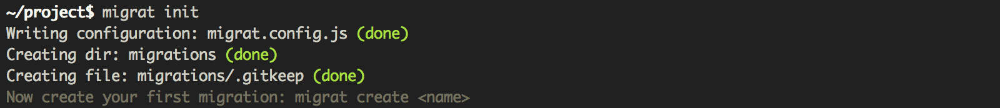
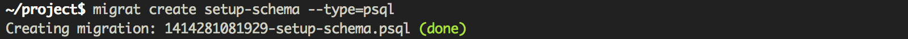
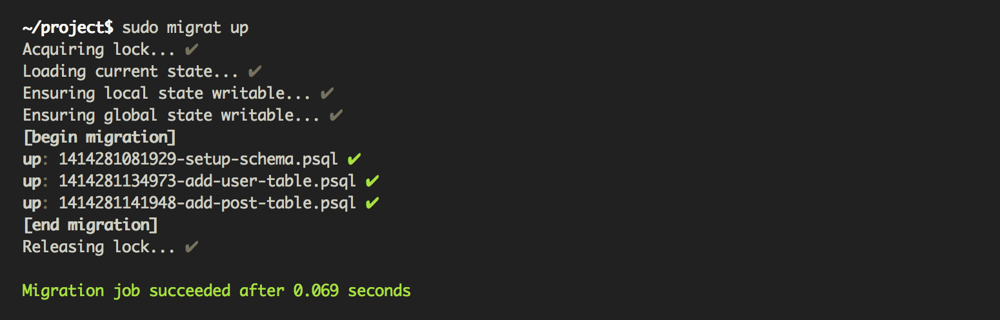

# Migrat
[](https://www.npmjs.org/package/migrat)
[](https://travis-ci.org/naturalatlas/migrat)
[](https://coveralls.io/r/naturalatlas/migrat)

*Migrat is a pluggable Node.js migration tool designed for diverse stacks and processes.* It is not tied any particular database engine and supports multi-node environments by differentiating migrations that should run on one node (to update a global database, for instance) and migrations that should run on all nodes (like updating a per-node cache).

```sh
$ npm install -g migrat
```

### Features

- Migrations can be set to set to run once globally, or once per server.
- Supports global locking during migration runs, to prevent multiple servers attempting to perform global migrations at the same time.
- Pass context through to each migration. This can be a logging interface, a set of database connections, ... it's up to you.
- Custom hooks throughout the migration process.
- Perform dry runs to see the migration plan before it's executed.
- Plugin-friendly (see below)

### Plugins

Migrat works great on its own, but it's even better with plugins to reduce boilerplate. Plugin list (the ones without links haven't been developed yet – help welcome (see the ["Writing Plugins"](https://github.com/naturalatlas/migrat/wiki/Writing-Plugins) guide):

 - [`migrat-postgres`](https://github.com/naturalatlas/migrat-postgres) – Locks, state storage, and migration files in pure SQL.
 - [`migrat-sh`](https://github.com/naturalatlas/migrat-sh) – Execute shell script migration files.
 - `migrat-mysql` – Locks, state storage, and migration files in pure SQL.
 - `migrat-hipchat` – Send live migration status to a [HipChat](https://www.hipchat.com/) room.
 - `migrat-slack` – Send live migration status to a [Slack](https://slack.com/) channel.
 - `migrat-datadog` – Send migration results to a [Datadog](https://www.datadoghq.com) dashboard.
 - `migrat-php` – Execute PHP migration files.

With plugins, you can have a migration directory that looks like:

```
./1414275876214-create-schema.psql
./1414275879591-backfill-avatars.js
./1414275876214-process-something.php
```

### Screenshots





### Usage Examples

```sh
$ migrat create add-user-table
# creates migrations/1413963352671-add-user-table.js

$ migrat create add-user-table --all-nodes
# creates migrations/1413963352671-add-user-table.all.js
```

```sh
$ migrat init  # set up a migrat project in the current directory
$ migrat up --dry-run  # show which migrations need to be run
$ migrat up [filename]  # get up to date (only forward)
$ migrat down <filename>  # go back to a specific migration
```

## Documentation

### Migration Files

Migration files are pretty standard:

```js
// (required) apply the change
module.exports.up = function(context, callback) { /* ... */ };

// (required) revert the change
module.exports.down = function(context, callback) { /* ... */ };

// (optional) verify the change took place
module.exports.check = function(context, callback) { /* ... */ };
```

### Project Configuration

Migrat will look for for a `migrat.config.js` in your project directory, unless overriden by `--config`:

```js
module.exports = {
    // REQUIRED. The folder to store migration scripts in.
    migrationsDir: './migrations',

    // REQUIRED. Where the current migration state specific to the
    // current machine is to be stored. This is only used to for
    // migrations created with the `--all-nodes` flag. Make sure
    // it is writable by the user executing migrat and isn't wiped
    // out between deploys.
    localState: '/var/lib/my_app/.migratdb',

    // OPTIONAL. Invoked at the beginning of a run, this method
    // should return an object with any details you want passed
    // through to all migrations. This can be database connections,
    // logging interfaces, etc.
    context: function(callback) {
        callback(null, {});
    },

    // REQUIRED. Persists the current migration state. The `state`
    // argument will always be a variable-length string. Store it
    // to redis, disk, database, ... whatever suits you.
    storeState: function(state, callback) {
        callback();
    },

    // REQUIRED. This method is responsible for fetching the
    // current migration state, persisted by `storeState`.
    fetchState: function(callback) {
        callback(null, state);
    },

    // OPTIONAL. Provide a function that returns a string to use
    // as the source for a new migration file. The `details`
    // argument will be an object containing:
    //   * "user"      The current user.
    //   * "filename"  The name of migration file.
    //   * "timestamp" The Date object used to put the timestamp
    //                 at the beginning of the migration filename.
    migrationTemplate: function(details, callback) {
        fs.readFile('path/to/template.js', 'utf8', callback);
    },

    // OPTIONAL. Invoked at the beginning of a migration
    // run. Use this to establish a global lock. You can
    // either wait for a lock to become available, or fail.
    lock: function(callback) {
        callback();
    },

    // OPTIONAL (unless `lock` is implemented). Implement this to
    // release any global lock acquired by the `lock` function.
    unlock: function(callback) {
        callback();
    },

    // OPTIONAL. The number of milliseconds to give up after if
    // a lock cannot be obtained or released. This is only
    // applicable if the `lock` function is implemented.
    lockTimeout: 0,

    // OPTIONAL. Invoked at the very beginning of a run before
    // any locks are acquired or state is read. Use this to
    // establish any connections needed by `fetchState`,
    // `storeState`, `lock`, `unlock`, and `context`.
    initialize: function(callback) {
        callback();
    },

    // OPTIONAL. Callback executed right before all
    // queued migrations are executed.
    beforeRun: function(runlist, callback) {
        callback();
    },

    // OPTIONAL. Callback executed before each migration.
    beforeEach: function(runlist_item, callback) {
        callback();
    },

    // OPTIONAL. Callback executed after each migration.
    afterEach: function(err, runlist_item, callback) {
        callback();
    },

    // OPTIONAL. Callback executed right after all
    // queued migrations are executed.
    afterRun: function(err, runlist, callback) {
        callback();
    },

    // OPTIONAL. Invoked at the very tail end of a run once locks
    // are released and state has been stored. Use this to tear
    // down any connections established in `initialize`.
    terminate: function(callback) {
        callback();
    }
};
```

## Contributing

Before submitting pull requests, please update the [tests](test) and make sure they all pass.

```sh
$ npm test
```

## License

Copyright &copy; 2014 [Brian Reavis](https://github.com/brianreavis) & [Contributors](https://github.com/naturalatlas/migrat/graphs/contributors)

Licensed under the Apache License, Version 2.0 (the "License"); you may not use this file except in compliance with the License. You may obtain a copy of the License at: http://www.apache.org/licenses/LICENSE-2.0

Unless required by applicable law or agreed to in writing, software distributed under the License is distributed on an "AS IS" BASIS, WITHOUT WARRANTIES OR CONDITIONS OF ANY KIND, either express or implied. See the License for the specific language governing permissions and limitations under the License.
